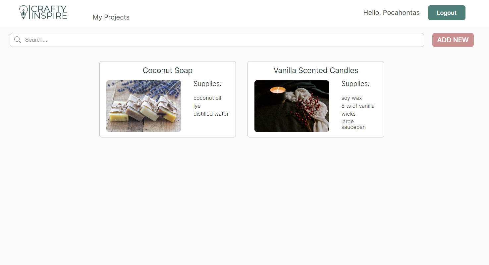

# Crafty Inspire

Crafty Inspire is an open-source project for an online platform dedicated to manage DIY projects. You can save your craft ideas and add tags, materials, descriptions and other useful information for working with it later.



## Usage

To get the full system up locally, use `docker compose`:

```shell
$ cd src
$ docker compose build
$ docker compose up
```

This will:

- build the client assets, including the JavaScript production bundle;
- start nginx on port 8080 to serve those assets;
- start the Node.js server on port 5000;
- start PostgreSQL on port 5433.

Then open http://localhost:8080, register an user and interact with the project.


## Overview

This repository contains the full code of the React client application, Node.js web application and infrastructure configurations.


### Directory structure

Under `src/`, we have 3 main components:
- `client/`: the self-contained React application;
- `server/`: the standalone Node.js express server, using Apollo server for exposing the API via GraphQL;
- `infrastructure/`: deployment configuration files.

Each of those has its own `Dockerfile` that is also consumed by the top-level `src/docker-compose.yml`.

```
src/
  client/
    Dockerfile
    package.json
    src/
      *.js
  server/
    Dockerfile
    package.json
    src/
      *.ts
    tests/
      *.ts
  infrastructure/
    Dockerfile
    nginx.conf
  docker-compose.yml
```


### Authentication and authorization

The auth API is done via 2 REST endpoints: `/register` and `/login`.  The login response contains a JSON body with the session token in it, that the client application stores on `localStorage` for future accesses.


### API and database schema

The [GraphQL API](src/server/src/schema.ts) is served under `/api/graphql`, and requires the requests to be authenticated via the `Authentication: Bearer XXX` header.

The main entity of the [database schema](src/server/src/migrations/) is the `projects` table, which gets exposed via GraphQL as the `Project` type.


### Development tooling

Both `src/client/` and `src/server/` have their own `package.json` file, which contains the canonical scrips for testing and running the applications.


## Contributing

PRs are welcome.  Make sure to adapt or add tests to the affected lines of code.


## License

All source code is under [AGPL 3.0 or later](https://www.gnu.org/licenses/agpl-3.0.html).  Images are under the [Unsplash free license](https://unsplash.com/license).
